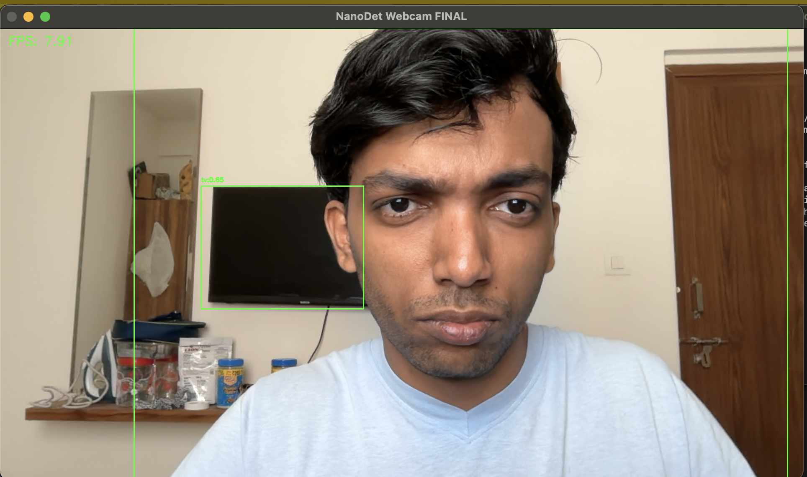
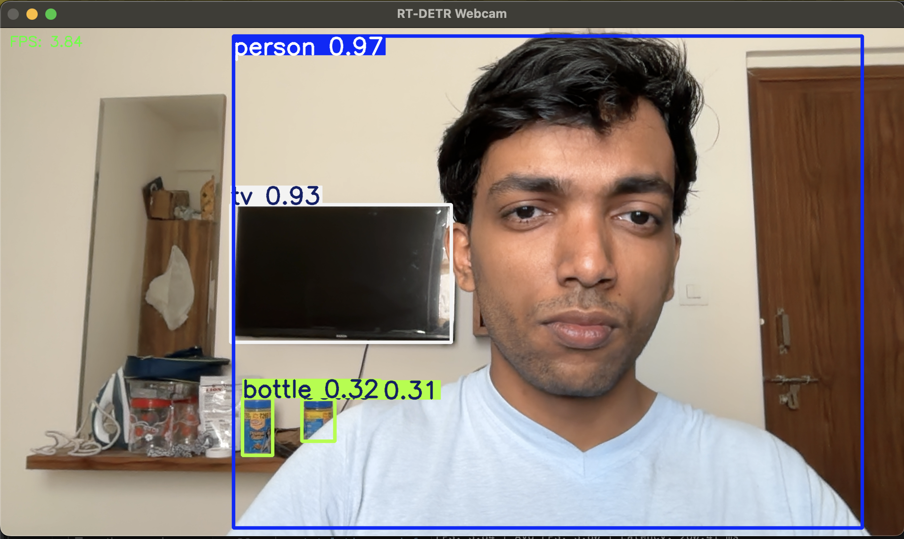
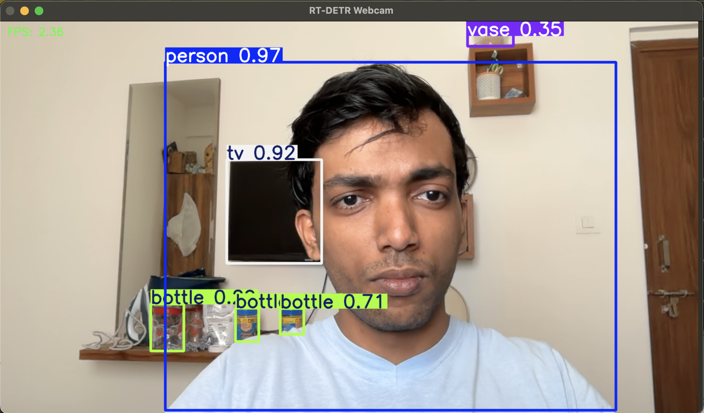
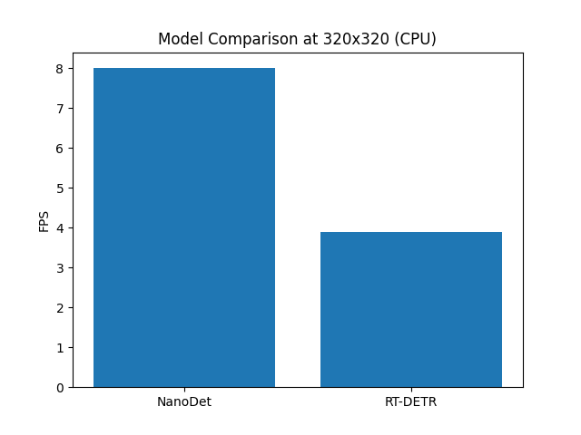
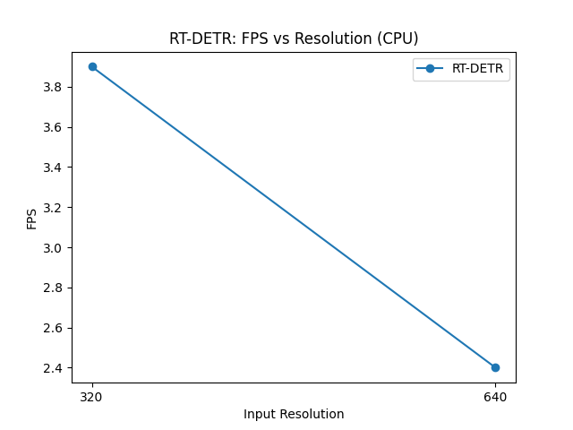

# Edge AI Object Detection (NanoDet vs RT-DETR Performance Comparison)

A real-time object detection system designed for edge devices, comparing lightweight CNN and transformer-based models for object detection.

## Overview

Built as a hands-on exploration of real-time edge AI systems, focusing on performance, debugging, and model trade-offs. Implemented and benchmarked using two state-of-the-art detection models:

- **NanoDet**: lightweight, fast, edge-friendly (CNN-based)
- **RT-DETR**: high accuracy, transformer-based detector

The focus is on:

- Real-time webcam inference
- CPU-based edge performance
- Speed vs accuracy trade-off


This project focuses on understanding real-world deployment challenges, including dependency conflicts, model debugging, and performance optimization on CPU-only systems.


## ⚠️ Note

The `nanodet/` directory contains the official NanoDet repository (https://github.com/RangiLyu/nanodet), used and adapted for this project.


## My Contribution


- Built end-to-end real-time inference pipelines for both models
- Debugged NanoDet pipeline issues (warp_matrix, meta structure, tensor handling)
- Implemented performance benchmarking (FPS, latency)
- Compared CNN vs Transformer models under identical conditions
- Optimized RT-DETR using input resolution tuning (640 → 320)

## Key Insights
- Demonstrates practical trade-offs between CNN efficiency and Transformer accuracy in edge scenarios
- NanoDet achieves ~3× faster inference than RT-DETR
- RT-DETR provides better contextual detection
- Reducing resolution improves RT-DETR speed by ~70%
- Trade-off: speed vs accuracy

## Sample Output

### NanoDet Output


### RT-DETR Output (320)


### RT-DETR Output (640)


#### Detailed performance logs and analysis are available in the `results/` directory.

## Project Structure

```
edge-ai-defect/
├── nanodet/                 # NanoDet implementation and demos
│   ├── main.py             # Main entry point
│   ├── webcam_demo.py      # Real-time webcam detection
│   ├── config/             # Model configurations
│   ├── demo/               # Additional demos
│   ├── nanodet/            # Core model code
│   └── workspace/          # Pre-trained checkpoints
├── rt-detr/                # RT-DETR implementation
│   ├── webcam_rtdetr.py    # Real-time webcam detection
│   └── rtdetr-l.pt         # Pre-trained model weights
└── results/                # Performance analysis and comparisons
    ├── comparison.txt      # Model comparison summary
    ├── metrics.txt         # Detailed performance metrics
    └── performance_log.txt # Raw inference logs
```

## Models Comparison

| Model | FPS (CPU) | Latency | Type | Use Case |
|-------|-----------|---------|------|----------|
| NanoDet (320x320) | ~8 FPS | ~125ms | CNN | Edge devices, real-time |
| RT-DETR (640x640) | ~2.4 FPS | ~410ms | Transformer | Accuracy-critical |
| RT-DETR (320x320) | ~3.9 FPS | ~260ms | Transformer | Balanced performance |


## 📊 Performance Visualization

### Model Comparison (320x320)



NanoDet achieves significantly higher FPS compared to RT-DETR at the same resolution, making it more suitable for real-time edge deployment.

---

### RT-DETR: Resolution Impact



RT-DETR shows a noticeable drop in FPS as input resolution increases, highlighting the trade-off between accuracy and inference speed.


## Quick Start

### 🔹 NanoDet (Recommended Setup)

> ⚠️ Tested on: **Apple MacBook Air (M4, CPU-only inference)**

> ⚠️ Python 3.9.18 is required for compatibility
> Python version and dependency versions are important to avoid known issues.

#### 1. Clone NanoDet (Official Repository)

```bash
git clone https://github.com/RangiLyu/nanodet.git
cd nanodet
```

> This project builds on top of the official NanoDet implementation.

---

#### 2. Environment Setup

```bash
# Create virtual environment
python3 -m venv nanodet-env
source nanodet-env/bin/activate

# Install base dependencies
pip install -r requirements.txt

# Install compatible versions (IMPORTANT)
pip install torch==1.13.1 torchvision==0.14.1
pip install opencv-python==4.7.0.72 "numpy<2"
```

---

#### 3. Install NanoDet (Editable Mode)

```bash
pip install -e .
```

> This allows importing NanoDet modules from the local repository.

---

#### 4. Add Project Files

Copy the following file into the cloned NanoDet repository:

edge-ai-defect/nanodet/webcam_demo.py → nanodet/webcam_demo.py

---

#### 5. Run Webcam Demo

```bash
python webcam_demo.py
```

---

### ⚠️ Common Issues (Already Handled)

* NumPy 2.x causes compatibility issues → use `numpy<2`
* OpenCV (installed via dependencies) requires compatible NumPy version
* CUDA not required (CPU inference used)
* `warp_matrix` and post-processing issues already handled in code

---

### 🔹 RT-DETR Setup

```bash
cd rt-detr

pip install ultralytics 

python webcam_rtdetr.py
```

---

## ▶️ How to Run

Make sure you are inside the correct directory:

```bash
cd nanodet
python webcam_demo.py
```

> ⚠️ Important: The script uses relative paths (`config/`, `workspace/`), so it must be executed from inside the `nanodet/` folder.

---

## 🖥️ Hardware Context

All benchmarks were performed on:

* Device: Apple MacBook Air (M4)
* Inference: CPU-only
* No GPU acceleration used

This reflects realistic **edge deployment conditions**.

---

## 📚 References

* NanoDet (Official Repository): https://github.com/RangiLyu/nanodet
* RT-DETR (Ultralytics): https://docs.ultralytics.com

---


## 📄 License

This project builds on top of external repositories:

- NanoDet: https://github.com/RangiLyu/nanodet
- RT-DETR (Ultralytics): https://docs.ultralytics.com

All model architectures, pretrained weights, and core implementations belong to their respective authors.

This repository contains only custom modifications, including:
- Webcam inference pipelines
- Performance benchmarking
- Debugging and optimization for CPU inference

Please refer to the original repositories for their respective licenses and usage terms.
